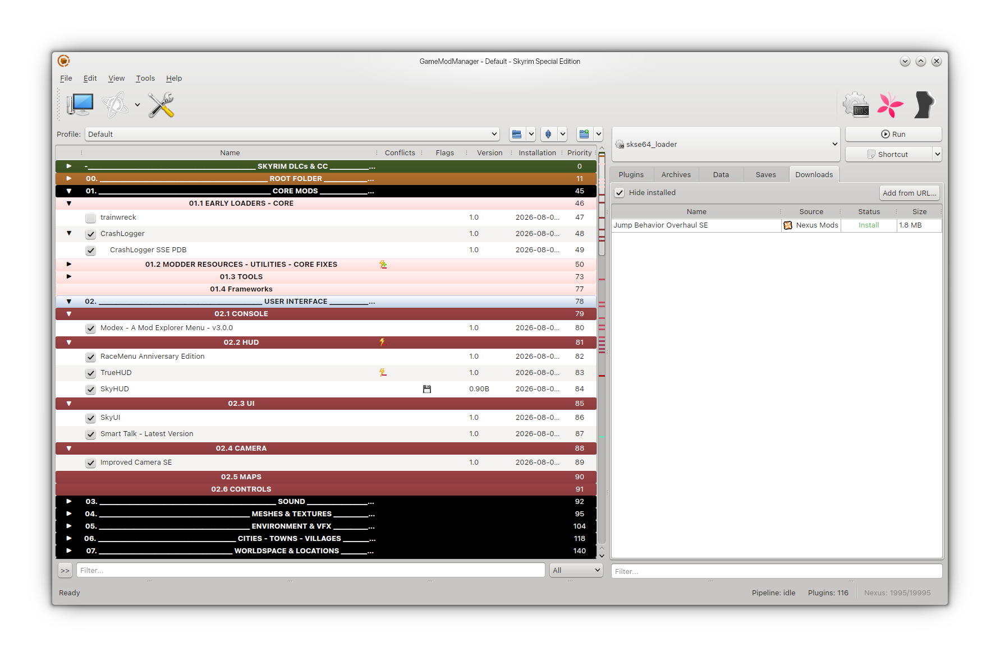

> [!WARNING]  
> This project is under active development and will break often. Please do not try to use it in it's current state beyond just a simple preview.

<div align="center">

# GameModManager

A cross-platform, plugin-driven game mod manager with an MO2-style UI. Drop in a game plugin - no core rebuild needed.

</div>



---

## Chapters

1. [Features](#features)
2. [Supported Games](#supported-games)
3. [Building from Source](#building-from-source)
4. [Running](#running)
5. [Architecture](#architecture)
6. [Writing a Game Plugin](#writing-a-game-plugin)
7. [Tests](#tests)
8. [Known Issues & Roadmap](#known-issues--roadmap)

---

## Features

- **MO2-style mod list** - virtual mod list with drag-and-drop reordering, a fixed game-native (unmanaged) band pinned above user mods, separators with fold arrows, conflict status icons
- **Plugin-based game support** - each game is a separate shared library loaded via the stable C ABI (dlopen/LoadLibrary)
- **Multi-instance support** (portable and global)
- **Deploy strategies:**
    - [x] OverlayFS (Linux default)
    - [x] symlink
    - [ ] Direct (Copy/In Place)
    - [ ] hardlink
    - [ ] NTFS junction (Windows)
    - [ ] UVFS (Windows)
    - [ ] FUSE VFS (Linux)
- **Conflict detection** with priority-ordered file overwrites and conflict-resolution dialogs 
- **Downloads tab** - Nexus + Steam Workshop sources, per-file progress/Pause, `nxm://` link routing via IPC, untracked-archive scan
- **Themeable** via QSS token templates (Dark + Nord bundled, plus Qt built-in styles)
- **Python scripting tier** via pybind11
- **Headless CLI** - launch games without the UI, handle `nxm://` & `gmm://` links for cross-mod manager routing 
- Cross-platform: Linux, Windows & (macOS planned)

---

## Supported Games

| Game | Status | Plugin |
|------|--------|--------|
| The Binding of Isaac: Rebirth | Supported | `TheBindingOfIsaacRebirth.so` / `.dll` |
| Skyrim Special Edition | Supported | `SkyrimSpecialEdition.so` / `.dll` |

Tool plugins (non-game): `ImageDiff`, `IsaacModSorter`.

Adding a new game requires only a new plugin file.

---

## Building from Source

### Dependencies

| Library | Version | Purpose |
|---------|---------|---------|
| Qt 6 | ≥ 6.0 | UI framework |
| Qt6Keychain | ≥ 0.14 | OS keyring backend |
| libzip | - | Archive extraction |
| sqlite3 | - | Mod cache |
| yaml-cpp | - | Config / masterlist parsing |
| libcurl | - | HTTP downloads |
| nlohmann/json | - | JSON parsing |
| pybind11 | 2.13.6 (fetched) | Python embedding |
| Python 3 | ≥ 3.10 | Plugin scripting |
| libfuse3 | (optional) | VFS/OverlayFS deploy |

### Linux (Ubuntu/Debian)

```bash
# Install dependencies
sudo apt-get update
sudo apt-get install -y \
    qt6-base-dev cmake g++ \
    libzip-dev libsqlite3-dev libyaml-cpp-dev \
    libcurl4-openssl-dev nlohmann-json3-dev \
    libfuse3-dev libpython3-dev \
    qtkeychain-qt6-dev \
    icoutils

# Clone with submodules
git clone --recurse-submodules https://github.com/PetricaT/GameModManager.git
cd GameModManager/Core

# Configure (Release recommended - Debug bloats the binary ~12x)
cmake -B build -DCMAKE_BUILD_TYPE=Release

# Build
cmake --build build -j$(nproc)

# The binary is at build/gamemodmanager
# Plugins are at build/plugins/
```

### Windows

```bash
# Install dependencies via vcpkg
vcpkg install qt6-base qtkeychain libzip sqlite3 yaml-cpp libcurl nlohmann-json pybind11 python3 --triplet x64-windows

# Clone with submodules
git clone --recurse-submodules https://github.com/PetricaT/GameModManager.git
cd GameModManager/Core

# Configure
cmake -B build -DCMAKE_BUILD_TYPE=Release -DCMAKE_TOOLCHAIN_FILE="$env:VCPKG_ROOT/scripts/buildsystems/vcpkg.cmake"

# Build
cmake --build build --config Release
```

### macOS

> [!NOTE]
> macOS support is planned. The build should work but platform-specific paths and native launch are not yet implemented.

```bash
# Install dependencies via Homebrew
brew install qt@6 qtkeychain libzip sqlite3 yaml-cpp curl nlohmann-json python@3

# Clone with submodules
git clone --recurse-submodules https://github.com/PetricaT/GameModManager.git
cd GameModManager/Core

# Configure
cmake -B build -DCMAKE_BUILD_TYPE=Release \
    -DCMAKE_PREFIX_PATH="$(brew --prefix qt@6)"

# Build
cmake --build build -j$(sysctl -n hw.ncpu)
```

---

## Running

```bash
# Normal launch (opens the last-used instance)
./build/gamemodmanager

# Launch a specific instance
./build/gamemodmanager --instance The_Binding_of_Isaac_Rebirth

# Headless launch: deploy mods and start a game without the UI
GMM_DEBUG=1 ./build/gamemodmanager --launch --instance Skyrim_Special_Edition \
    --exe skse64_loader.exe

# Route an nxm:// download link to the running instance (or queue it headless)
./build/gamemodmanager --handle-nxm "nxm://skyrimspecialedition/mods/..."
```

CLI flags: `--instance <name|path>`, `--launch`, `--exe <relative path>`, `--handle-nxm <url>`, `--handle-gmm <url>`, `--help`.

On first run, the app shows a game selection screen. After selecting a game, an instance is created under `~/.local/share/GameModManager/instances/`.

`GMM_DEBUG=1` shows debug-level log lines in the console (the log file always has full verbosity). Crash dumps land in `~/.local/share/GameModManager/crashes/`.

---

## Architecture

```
src/
├-- cli/                    # Headless CLI (--launch, --handle-nxm)
├-- engine/                 # Qt-free core - no Qt headers allowed here
│   ├-- archive/            # Zip extraction
│   ├-- cache/              # SQLite mod cache
│   ├-- deploy/             # OverlayFS, symlink, hardlink, junction, FUSE strategies + deploy ledger
│   ├-- detect/             # Game detection, mod scanning
│   ├-- index/              # Conflict index
│   ├-- instance/           # Instance management (portable + installed)
│   ├-- keyring.{h,cpp}     # Keyring interface + secure file fallback
│   ├-- launcher.{h,cpp}    # Shared game-launch chain (process-group watch, overlay tiers)
│   ├-- log/                # Logger + crash handler
│   ├-- meta/               # Metadata parsers
│   ├-- model/              # Profile model
│   ├-- notify/             # Notification backends
│   ├-- nxm/                # nxm:// router + IPC server (single-instance guard)
│   ├-- overlay_launcher / preload_interceptor # OverlayFS 3-tier capture chain
│   ├-- overwrite/          # Overwrite movers/sync logic
│   ├-- pipeline/           # 8-stage pipeline (fetch→...→launch)
│   ├-- plugin_host/        # dlopen loader + Python embedding
│   ├-- plugins/            # PluginDatabase (MO2 PluginList port), TES4 header parser
│   ├-- registry/           # Stage registry, hook registry, GameKnowledge
│   ├-- source/             # Source providers: Nexus, Steam Workshop
│   ├-- sort/               # Generic sort provider + ABI wrapper
│   ├-- theme/              # QSS token-template engine
│   ├-- trace/              # Pipeline trace recorder
│   ├-- workshop/           # Steam Workshop / remote cache
│   └-- nexus_auth.{h,cpp}  # Nexus API auth + rate limits
├-- keyring/                # QtKeychain backend (Qt-bound; engine stays Qt-free)
├-- platform/               # OS-specific (linux/, windows/, macos/)
├-- runtime/                # ProtonRuntime, NativeRuntime, WineRuntime
├-- ui/                     # Qt Widgets - lives here, never in engine/
│   ├-- main_window/        # Main window, toolbar, status bar, launch + highlight wiring
│   ├-- widgets/            # Mod list (ModListModel), filter bar, console, etc.
│   ├-- panels/             # Plugins/Archives/Data/Saves/Downloads tabs
│   ├-- settings/           # Settings singleton + 8-tab SettingsContentWidget (popup SettingsDialog wrapper)
│   ├-- overwrite/          # MO2 overwrite dialogs (sync, move-to-mod, query, browser)
│   ├-- game_selection/     # First-run game picker
│   └-- pipeline_worker.cpp # Pipeline runs on a worker QThread
└-- main.cpp                # Entry point
```

### Plugin System

Game-specific logic lives in shared libraries under `external/plugins/`. Each plugin implements `gmm_register_v1()` from the ABI header and registers identity, hooks, tabs, and metadata via the `GmmRegistrationCtx` callbacks. The engine discovers and loads plugins at startup via `dlopen`/`LoadLibrary`, and a version guard (`gmm_abi_version`) checks ABI compatibility.

```
external/
├-- abi/                            # Stable C ABI header (gmm_abi_v1.h, GMM_ABI_VERSION=1)
└-- plugins/
    ├-- CMakeLists.txt
    ├-- SkyrimSpecialEdition/       # Skyrim SE: plugins.txt load order, Data/ layout
    ├-- TheBindingOfIsaacRebirth/   # Isaac: mods/ layout, metadata.xml parsing
    └-- Tools/                      # ImageDiff, IsaacModSorter
```

---

## Writing a Game Plugin

Create a C/C++ file in `external/plugins/yourgame/`:

```cpp
#include "gmm_abi_v1.h"

static const uint32_t STEAM_APPID = 12345;

/* plugins.txt / metadata.xml writer */
static int order_encoding(const char* const* ordered_ids, size_t count,
                          const char* output_path, void* user_data) {
    /* ...write the load order file... */
    return 1;
}

extern "C" void gmm_register_v1(GmmRegistrationCtx* ctx) {
    ctx->register_identity(ctx, STEAM_APPID,
        NULL, NULL,              /* gog_id, epic_namespace */
        "yournexusdomain",       /* nexus_domain */
        "Your Game", NULL, NULL, NULL);

    if (ctx->register_meta)
        ctx->register_meta(ctx, "You", "0.1.0", "Your Game support");
    if (ctx->register_category)
        ctx->register_category(ctx, "Game Support");

    ctx->register_hook(ctx, "mods_subpath", "Data", NULL, 0, NULL);

    ctx->register_tab(ctx, "plugins", "Plugins", "Data/",
        "ESP/ESM plugin files", NULL, NULL, NULL, NULL, NULL);

    ctx->register_order_encoding(ctx, order_encoding);
}

extern "C" uint32_t gmm_abi_version(void) {
    return GMM_ABI_VERSION;
}
```

Build it as a shared library and drop it into the `plugins/` directory. The core will pick it up on next launch - no recompilation needed.

See `external/plugins/SkyrimSpecialEdition/GameSupport/SkyrimSpecialEdition.cpp` for a complete real-world example. Registering metadata/category/settings callbacks is optional - NULL-check them so plugins built against older headers keep loading (ABI stays v1).

---

## Known Issues & Roadmap

- [ ] macOS platform module (Phase 4) - build works, platform paths/native launch pending
- [ ] Windows native launch + UVFS tier (Phase 3)
- [ ] Non-Steam game detection (GOG, Epic via Heroic/Lutris)
- [ ] Portable instance renaming
- [ ] Additional game plugins
- [ ] More source providers (DirectURL, LocalArchive)
